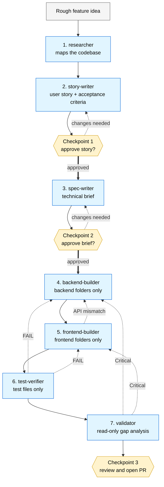

# Agent Hub

A personal hub of reusable Claude Code agents, skills, and rules that work across any project.

**Status:** v0.2.0 — Project auto-detection, project-shape skip logic (backend-only / frontend-only / library projects skip irrelevant builders), and escalating retry context have landed. See [CHANGELOG.md](CHANGELOG.md).

## What's in here

```
agents/                # one file per agent — the 7-agent factory chain
skills/                # multi-step orchestrators (currently: feature-factory)
hooks/                 # reusable git hooks (currently: block-secrets)
templates/             # skeleton for new hub agents
diagrams/              # mermaid diagrams explaining the chain, distribution, drift loop
install.sh             # Claude Code installer (macOS / Linux / git-bash)
install.ps1            # Claude Code installer (Windows PowerShell)
sync-windsurf.sh       # Windsurf workspace sync (symlinks by default)
agent-hub-detect.sh    # Auto-generate .agenthub-config.yaml for any project
VERSION                # hub-wide semver tag
CHANGELOG.md           # what changed in each release
```

## The 7-agent factory chain



| # | Agent | Tools | Role |
|---|---|---|---|
| 1 | [researcher](agents/researcher.md) | Read, Grep, Glob | Maps relevant code before any feature work begins |
| 2 | [story-writer](agents/story-writer.md) | Read | Turns idea into user story + acceptance criteria |
| 3 | [spec-writer](agents/spec-writer.md) | Read, Grep, Glob | Turns approved story into technical brief |
| 4 | [backend-builder](agents/backend-builder.md) | Read, Edit, Write, Bash | Implements backend half + unit tests |
| 5 | [frontend-builder](agents/frontend-builder.md) | Read, Edit, Write, Bash | Implements frontend half + UI tests |
| 6 | [test-verifier](agents/test-verifier.md) | Read, Edit, Write, Bash | Writes acceptance tests against the story |
| 7 | [validator](agents/validator.md) | Read, Grep, Glob | Read-only gap analysis vs story and brief |

Orchestrated by the [feature-factory](skills/feature-factory/SKILL.md) skill. Three human checkpoints: story approval, brief approval, PR review.

More diagrams — distribution model and the drift loop — under [diagrams/](diagrams/).

## Installation

Clone the repo and run the installer for your OS.

**macOS / Linux / git-bash on Windows:**

```bash
git clone https://github.com/kpassoubady/agent-hub.git
cd agent-hub
./install.sh
```

**Windows (PowerShell):**

```powershell
git clone https://github.com/kpassoubady/agent-hub.git
cd agent-hub
.\install.ps1
```

Both installers copy modules to `~/.claude/` (the global Claude Code config) so the agents are available across every project. Re-running is safe — existing files are skipped unless you pass `--force`.

### Common flags

| Flag | Purpose |
|---|---|
| (no args) | Install all modules: `agents`, `skills`, `templates`, `hooks` |
| `agents skills` | Install only the listed modules |
| `-f` / `--force` (sh) or `-Force` (ps1) | Overwrite existing files |
| `-d` / `--dry-run` (sh) or `-DryRun` (ps1) | Show what would happen without writing |
| `-p PATH` (sh) or `-Path PATH` (ps1) | Per-project install: target `<project>/.claude` instead of `~/.claude` |
| `-h` / `--help` (sh) or `-Help` (ps1) | Show help |

### Verifying the install

After `./install.sh`, in Claude Code: `/feature-factory <feature description>` should launch the orchestrator.

The 7 agents land in `~/.claude/agents/`, the skill in `~/.claude/skills/feature-factory/`, the pre-commit hook in `~/.claude/hooks/block-secrets.sh` (ready to symlink into a project's `.git/hooks/`).

## Project-specific configuration

Each agent reads `.agenthub-config.yaml` at the consuming project's root.

### Auto-generate it

In any project, run:

```bash
/path/to/agent-hub/agent-hub-detect.sh                  # detect current dir
/path/to/agent-hub/agent-hub-detect.sh /path/to/project # detect a specific project
/path/to/agent-hub/agent-hub-detect.sh -d               # dry-run; print to stdout
```

The detector scans the project, identifies language and framework, derives the project shape, and writes `.agenthub-config.yaml` with sensible defaults. Re-run with `--force` to refresh from auto-detection.

### Schema (v2)

```yaml
project:
  # Which agents apply: full-stack | backend-only | frontend-only | library
  shape: full-stack
  language: node       # advisory; agents use it to pick conventions
  framework: vite      # advisory

backend:
  folders: ["src/server", "src/api"]
  test-command: "npm test --workspace=server"
  typecheck-command: "npm run typecheck --workspace=server"
  lint-command: "npm run lint --workspace=server"
frontend:
  folders: ["src/web", "src/components"]
  test-command: "npm test --workspace=web"
  typecheck-command: "npm run typecheck --workspace=web"
  lint-command: "npm run lint --workspace=web"
test:
  folders: ["tests/acceptance"]
  acceptance-framework: "playwright"
  command: "npx playwright test"
```

### Project shape — skip what you don't have

| `project.shape` | Chain |
|---|---|
| `full-stack` | All 7 agents run |
| `backend-only` | frontend-builder is skipped |
| `frontend-only` | backend-builder is skipped |
| `library` | frontend-builder is skipped; spec-writer treats the package's public API as the "interface" |

Even for `full-stack` projects, the orchestrator skips a builder per feature when the spec-writer's brief marks its section `None` — the brief is the per-feature source of truth.

The agents fall back to sensible defaults if a key is missing. If `project.shape` is missing, the chain assumes `full-stack` and warns once.

## What does NOT belong in this hub

The hub is generic by design — only agents that work in a brand-new repo after reading that repo's `CLAUDE.md`. Anything project-specific or personal lives elsewhere:

| Content | Belongs here? | Where it lives instead |
|---|---|---|
| Generic agent patterns (factory chain, pr-reviewer, etc.) | Yes | this repo |
| Templates for business agents (research, content, outreach) | Yes — skeleton only | `templates/` here |
| The *working* business agent (with your voice, ICP, competitors) | No | consuming project's repo |
| Project-specific agents (e.g. bookbuilder chapter validator) | No | that project's repo |
| Credentials, API keys, OAuth secrets | No | per-project `.env` (gitignored) |
| Personal/private agents you don't want to share | No | `~/.claude/agents/` or a separate private overlay repo |
| Feature-factory state from a run | No | `<project>/.claude/feature-factory/` (gitignored) |

If something tempts you to put private content here, that's the sorting rule telling you it belongs somewhere else.

The repo ships with a pre-commit hook ([hooks/block-secrets.sh](hooks/block-secrets.sh)) that refuses to commit common secret files and patterns — install it in any project that consumes the hub.

## Use with Windsurf

The agent files double as Windsurf workflows — Windsurf only requires `description:` in frontmatter, and the Claude-specific fields (`tools`, `model`, `version`, …) are silently ignored. A separate script handles the per-workspace sync.

```bash
# In the agent-hub directory
./sync-windsurf.sh                            # Sync to ./.windsurf/workflow/
./sync-windsurf.sh /path/to/workspace         # Sync to a specific workspace
./sync-windsurf.sh -f /path/to/workspace      # Force overwrite existing links
./sync-windsurf.sh --copy /path/to/workspace  # Copy instead of symlink
./sync-windsurf.sh -d                         # Dry run
```

Default is symlink so hub updates flow into every synced workspace automatically. After sync, each agent becomes a Windsurf slash command (`/researcher`, `/spec-writer`, …) and the orchestrator becomes `/feature-factory`.

### What works in Windsurf
- Full agent body and instructions
- Three human checkpoints (conversational pauses)
- Slash-command invocation per agent

### What's different from Claude Code

| Claude Code | Windsurf |
|---|---|
| Subagents with isolated context windows | Cascade runs everything in one context |
| Hard tool restrictions (e.g. `tools: Read, Grep, Glob`) | Guidance only — Cascade has full tools |
| Per-agent model selection | One Cascade model |
| Backend / frontend folder hard scoping | Guidance only |

The discipline lives in the prompts more than in the tool restrictions, so the chain still works — it just relies on the agents *following* the rules rather than being *blocked* from breaking them.

### Cursor & Copilot

Not directly supported. Cursor uses `.cursor/rules/*.mdc` (different frontmatter schema); Copilot uses a single `.github/copilot-instructions.md` per workspace (no slash commands, no per-agent files). Adapters could be added if you use them more.

## What's next

- Run the chain against a real feature (canary).
- Write snapshot tests per agent.
- Add the generic dev agents — pr-reviewer, test-generator, doc-writer, refactor-tracker.
- Add a `--target windsurf` mode (or merge `sync-windsurf.sh` into `install.sh`) if multi-tool installation becomes a frequent need.

## License

[MIT](LICENSE). Personal hub — feedback welcome, no SLA on PRs.
