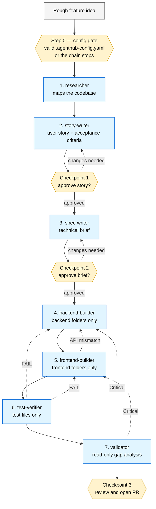

# Agent Hub

A personal hub of reusable Claude Code agents, skills, and rules that work across any project.

**Status:** v0.8.0 — added `test-bootstrap` to stand up a real test framework for projects that have none, and `agent-hub-detect.sh` no longer emits a config pointing at folders that don't exist. See [CHANGELOG.md](CHANGELOG.md).

## What's in here

```
agents/                # one file per agent — the 7-agent factory chain
skills/                # multi-step orchestrators
  feature-factory/     #   end-to-end feature builder with 3 checkpoints
  adaptive-engine/     #   dynamic orchestration layer (planner agent → custom graph)
  test-bootstrap/      #   installs a minimal real test framework for a project that has none
  loop-engine/         #   generic loop protocol (DISCOVER → PLAN → EXECUTE → VERIFY → ITERATE)
  graph-engine/        #   generic graph protocol (nodes, edges, fan-out/fan-in, reality anchors)
hooks/                 # reusable git hooks (currently: block-secrets)
templates/             # skeletons for new hub agents, loop-aware skills, and graph-aware skills
diagrams/              # mermaid diagrams: chain, distribution, drift loop, loop framework, graph engine, adaptive engine
docs/                  # guides and reference documentation (incl. config-gate-guide.md)
install.sh             # Claude Code installer (macOS / Linux / git-bash)
install.ps1            # Claude Code installer (Windows PowerShell)
claude_install.sh      # alias for install.sh (matches personal-helper naming)
claude_install.ps1     # alias for install.ps1
gemini_install.sh      # Gemini / Antigravity plugin installer
gemini_install.ps1     # Gemini / Antigravity plugin installer (Windows)
devin_install.sh       # Devin workspace sync wrapper (delegates to sync-devin.sh)
devin_install.ps1      # Devin workspace sync wrapper (Windows)
sync-devin.sh          # Devin workspace sync (symlinks by default)
sync-devin.ps1         # Devin workspace sync (Windows)
sync-github-copilot.sh # GitHub Copilot workspace/global sync (symlinks by default)
sync-github-copilot.ps1# PowerShell Copilot sync (Windows support, now with -Global)
install_all.sh         # run all installers at once
install_all.ps1        # run all installers at once (Windows)
agent-hub-detect.sh    # Auto-generate .agenthub-config.yaml for any project
VERSION                # hub-wide semver tag
CHANGELOG.md           # what changed in each release
```

## The 7-agent factory chain



| # | Agent | Tools | Role |
|---|---|---|---|
| 0 | *(orchestrator)* | Read, Bash | **Config gate** — validate or generate `.agenthub-config.yaml`; bind it to `00-config-resolved.md` |
| 1 | [researcher](agents/researcher.md) | Read, Grep, Glob | Maps relevant code before any feature work begins |
| 2 | [story-writer](agents/story-writer.md) | Read | Turns idea into user story + acceptance criteria |
| 3 | [spec-writer](agents/spec-writer.md) | Read, Grep, Glob | Turns approved story into technical brief |
| 4 | [backend-builder](agents/backend-builder.md) | Read, Edit, Write, Bash | Implements backend half + unit tests |
| 5 | [frontend-builder](agents/frontend-builder.md) | Read, Edit, Write, Bash | Implements frontend half + UI tests |
| 6 | [test-verifier](agents/test-verifier.md) | Read, Edit, Write, Bash | Writes acceptance tests against the story |
| 7 | [validator](agents/validator.md) | Read, Grep, Glob | Read-only gap analysis vs story and brief |

Orchestrated by the [feature-factory](skills/feature-factory/SKILL.md) skill (or the dynamic [adaptive-engine](docs/adaptive-engine-guide.md)). Three human checkpoints: story approval, brief approval, PR review.

Step 0 is a **blocking config gate** — the chain does not start without a valid `.agenthub-config.yaml`. See the [config gate guide](docs/config-gate-guide.md) for why it blocks, what counts as invalid, and the scope-overlap rule.

More diagrams — distribution model, drift loop, and loop framework — under [diagrams/](diagrams/).

## Loop framework

The hub includes a generic [loop-engine](skills/loop-engine/SKILL.md) that any skill can invoke for iterative, goal-directed work. Instead of each skill re-implementing retry logic, they follow a common protocol:

```
DISCOVER → PLAN → EXECUTE → VERIFY → ITERATE
```

The loop engine handles state tracking, escalating retry context, stop conditions, cost awareness, and three operating modes:

| Mode | Behaviour |
|---|---|
| `autonomous` | Runs to completion or limit — no human pauses |
| `checkpointed` | Pauses after every iteration for human review |
| `hybrid` | Runs on success; pauses on failure or limit (default) |

The [feature-factory](skills/feature-factory/SKILL.md) uses the loop engine at 5 points: story revisions, spec revisions, backend↔frontend handoff, test failure fixes, and validator critical fixes.

See the [loop framework diagram](diagrams/04-loop-framework.md) for the full lifecycle and the [loop guide](docs/loop-guide.md) for practical documentation on building your own loop-aware skills.

## Graph framework

A loop is one node with an edge back to itself. The hub also includes a generic [graph-engine](skills/graph-engine/SKILL.md) for skills that need more than one node — parallel fan-out, conditional routing, or multiple nodes' outputs reconciling before the chain continues. It composes `loop-engine` (each node's own retries still use the loop protocol) and maps directly onto Claude Code's native [dynamic workflows](https://code.claude.com/docs/en/workflows) `parallel()`/`agent()` primitives when available.

The [feature-factory](skills/feature-factory/SKILL.md) uses it at one point: Step 4 (backend-builder + frontend-builder) runs sequentially by default, or in parallel when `spec-writer` marks the brief's API contract precise enough (`API contract confidence: high`) and `.agenthub-config.yaml` allows it (`build.parallel-builders: auto | always`). Either way, a fan-in contract-check reconciles the brief's promise against what each builder actually produced before the chain proceeds.

See the [graph engine diagram](diagrams/05-graph-engine.md) and the [graph guide](docs/graph-guide.md) — including why naively parallelizing two nodes where one reads the other's live output is a race condition, not an optimization.

## Installation

Clone the repo and run the installer for your OS.

**macOS / Linux / git-bash on Windows:**

```bash
git clone https://github.com/kpassoubady/agent-hub.git
cd agent-hub
./install_all.sh
```

**Windows (PowerShell):**

```powershell
git clone https://github.com/kpassoubady/agent-hub.git
cd agent-hub
.\install_all.ps1
```

`install_all` sets up every supported assistant in one command:

- **Claude Code** — global `~/.claude/` (via `./install.sh`)
- **Gemini / Antigravity** — global `~/.gemini/config/plugins/agent-hub/` (via `./gemini_install.sh`)
- **Devin** — per-workspace `.devin/workflows/` (via `./sync-devin.sh`)
- **GitHub Copilot** — per-workspace `.github/copilot/` (via `./sync-github-copilot.sh`)

Run `install_all` from a project workspace to sync Devin and Copilot there, or run each installer separately for finer control.

### Per-tool installers

| Tool | macOS / Linux / git-bash | Windows PowerShell |
|---|---|---|
| Claude Code | `./install.sh` or `./claude_install.sh` | `.\install.ps1` or `.\claude_install.ps1` |
| Gemini / Antigravity | `./gemini_install.sh` | `.\gemini_install.ps1` |
| Devin | `./devin_install.sh` or `./sync-devin.sh` | `.\devin_install.ps1` or `.\sync-devin.ps1` |
| GitHub Copilot | `./sync-github-copilot.sh` | `.\sync-github-copilot.ps1` |

### Common flags

| Flag | Purpose |
|---|---|
| (no args) | Install all modules: `agents`, `skills`, `templates`, `hooks` |
| `agents skills` | Install only the listed modules |
| `-f` / `--force` (sh) or `-Force` (ps1) | Overwrite existing files |
| `-d` / `--dry-run` (sh) or `-DryRun` (ps1) | Show what would happen without writing |
| `-p PATH` (sh) or `-Path PATH` (ps1) | Per-project install: target `<project>/.claude` or `<project>/.gemini` instead of the global config |
| `-g` / `--global` (sh) or `-Global` (ps1) | Install GitHub Copilot globally (`~/.copilot`) instead of the workspace |
| `-h` / `--help` (sh) or `-Help` (ps1) | Show help |

### Verifying the install

After `./install.sh`, in Claude Code: `/feature-factory <feature description>` should launch the orchestrator.

The 7 agents land in `~/.claude/agents/`, the skill in `~/.claude/skills/feature-factory/`, the pre-commit hook in `~/.claude/hooks/block-secrets.sh` (ready to symlink into a project's `.git/hooks/`).

After `./sync-devin.sh`, in Devin: `/feature-factory <feature description>` should launch the orchestrator, and `/researcher`, `/spec-writer`, etc. are available as slash commands.

## Project-specific configuration

`.agenthub-config.yaml` at the consuming project's root tells the chain which agents apply, where their scope boundaries are, and how to verify work.

### It is required — Step 0 gates on it

As of v0.7.0, `/feature-factory` and `/adaptive-engine` **will not run without a valid config.** Step 0 has exactly three outcomes:

| Config state | What happens |
|---|---|
| **Missing** | The chain runs `agent-hub-detect.sh -d`, shows you the proposed YAML, and asks **accept / edit / abort**. Nothing runs until you confirm. |
| **Invalid** | The chain **stops** and reports every offending key. It does not fall back to defaults. |
| **Valid** | The resolved values are written to `00-config-resolved.md` in the run's state directory, and every agent reads *that* instead of re-deriving them. |

Why blocking rather than a warning: the earlier `warn once and assume full-stack` behaviour meant four separate stages — researcher, spec-writer, and both builders — independently re-derived the same test commands from `package.json` on every run. And a project that correctly declared `shape: backend-only` still had frontend-builder spawned on 8 of 18 features just to write "N/A". Resolving once and binding the result fixes both.

For a genuine throwaway, `--no-config` runs unconfigured and says so loudly in the final summary.

### Auto-generate it

In any project, run:

```bash
/path/to/agent-hub/agent-hub-detect.sh                  # detect current dir
/path/to/agent-hub/agent-hub-detect.sh /path/to/project # detect a specific project
/path/to/agent-hub/agent-hub-detect.sh -d               # dry-run; print to stdout
```

The detector scans the project, identifies language and framework, derives the project shape, and writes `.agenthub-config.yaml` with sensible defaults. Re-run with `--force` to refresh from auto-detection.

### Schema (v2)

```yaml
project:
  # Which agents apply: full-stack | backend-only | frontend-only | library
  shape: full-stack
  language: node       # advisory; agents use it to pick conventions
  framework: vite      # advisory

backend:
  folders: ["src/server", "src/api"]
  test-command: "npm test --workspace=server"
  typecheck-command: "npm run typecheck --workspace=server"
  lint-command: "npm run lint --workspace=server"
frontend:
  folders: ["src/web", "src/components"]
  # Optional. Individual files owned by this side when a folder is shared with
  # the other side — e.g. Next.js src/app holds both api/ routes and page.tsx.
  # Lets you keep scopes non-overlapping without splitting the framework's tree.
  files: ["src/app/page.tsx", "src/app/layout.tsx"]
  test-command: "npm test --workspace=web"
  typecheck-command: "npm run typecheck --workspace=web"
  lint-command: "npm run lint --workspace=web"
test:
  folders: ["tests/acceptance"]
  acceptance-framework: "playwright"
  command: "npx playwright test"

build:
  # auto (default) — parallelize backend/frontend only when spec-writer
  # marks the brief's API contract confidence: high. always/never override
  # spec-writer's per-feature judgment.
  parallel-builders: auto
```

### Project shape — skip what you don't have

| `project.shape` | Chain |
|---|---|
| `full-stack` | All 7 agents run |
| `backend-only` | frontend-builder is skipped |
| `frontend-only` | backend-builder is skipped |
| `library` | frontend-builder is skipped; spec-writer treats the package's public API as the "interface" |

Even for `full-stack` projects, the orchestrator skips a builder per feature when the spec-writer's brief marks its section `None` — the brief is the per-feature source of truth.

A skipped builder is **never spawned**. The orchestrator writes the one-line placeholder itself, naming the rule that caused the skip. Spawning an agent to report that it has nothing to do costs a context window and returns nothing the orchestrator didn't already know.

If `project.shape` is missing or unrecognised, Step 0 treats the config as invalid and stops — it no longer assumes `full-stack`.

### Scope boundaries must not overlap

`backend.folders` and `frontend.folders` are **hard scope restrictions**, so Step 0 rejects a config where one contains the other. Otherwise the outer builder is silently authorised to edit the inner one's files — e.g. `frontend.folders: [src/app]` alongside `backend.folders: [src/app/api]` lets frontend-builder rewrite your API routes.

When a framework directory genuinely holds both halves (Next.js App Router being the usual case), give the shared subtree to one side and list the other side's individual files under `files:`:

```yaml
backend:
  folders: [src/app/api, src/lib]
frontend:
  folders: [src/components, public]
  files:   [src/app/page.tsx, src/app/layout.tsx, src/app/globals.css]
```

`agent-hub-detect.sh` detects this case and emits a non-overlapping config automatically, with a `# NOTE:` explaining what it narrowed.

## What does NOT belong in this hub

The hub is generic by design — only agents that work in a brand-new repo after reading that repo's `CLAUDE.md`. Anything project-specific or personal lives elsewhere:

| Content | Belongs here? | Where it lives instead |
|---|---|---|
| Generic agent patterns (factory chain, pr-reviewer, etc.) | Yes | this repo |
| Templates for business agents (research, content, outreach) | Yes — skeleton only | `templates/` here |
| The *working* business agent (with your voice, ICP, competitors) | No | consuming project's repo |
| Project-specific agents (e.g. bookbuilder chapter validator) | No | that project's repo |
| Credentials, API keys, OAuth secrets | No | per-project `.env` (gitignored) |
| Personal/private agents you don't want to share | No | `~/.claude/agents/` or a separate private overlay repo |
| Feature-factory state from a run | No | `<project>/.claude/feature-factory/` (gitignored) |

If something tempts you to put private content here, that's the sorting rule telling you it belongs somewhere else.

The repo ships with a pre-commit hook ([hooks/block-secrets.sh](hooks/block-secrets.sh)) that refuses to commit common secret files and patterns — install it in any project that consumes the hub.

## Use with Devin

The agent files double as Devin workflows — Devin only requires `description:` in frontmatter, and the Claude-specific fields (`tools`, `model`, `version`, …) are silently ignored. A separate script handles the per-workspace sync.

```bash
# Sync to Devin
./sync-devin.sh                            # Sync to ./.devin/workflows/
./sync-devin.sh /path/to/workspace         # Sync to a specific workspace
./sync-devin.sh -f /path/to/workspace      # Force overwrite existing links
./sync-devin.sh --copy /path/to/workspace  # Copy instead of symlink
./sync-devin.sh -d                         # Dry run

# Sync to GitHub Copilot
./sync-github-copilot.sh                            # Sync to ./.github/copilot/
./sync-github-copilot.sh /path/to/workspace         # Sync to a specific workspace
./sync-github-copilot.sh --global                   # Sync to ~/.copilot/ globally
./sync-github-copilot.ps1 -Workspace /path/to/repo  # PowerShell for Windows
./sync-github-copilot.ps1 -Global                   # PowerShell global install
```

Default is symlink so hub updates flow into every synced workspace automatically. After sync, each agent becomes a Devin slash command (`/researcher`, `/spec-writer`, …) and the orchestrator becomes `/feature-factory`.

### What works in Devin
- Full agent body and instructions
- Three human checkpoints (conversational pauses)
- Slash-command invocation per agent

### What's different from Claude Code

| Claude Code | Devin |
|---|---|
| Subagents with isolated context windows | Cascade runs everything in one context |
| Hard tool restrictions (e.g. `tools: Read, Grep, Glob`) | Guidance only — Cascade has full tools |
| Per-agent model selection | One Cascade model |
| Backend / frontend folder hard scoping | Guidance only |
| Graph-engine parallel fan-out (dynamic workflows) | Not available — Cascade's single context runs Step 4 sequentially regardless of `build.parallel-builders` |

The discipline lives in the prompts more than in the tool restrictions, so the chain still works — it just relies on the agents *following* the rules rather than being *blocked* from breaking them.

### Cursor & Copilot

Cursor is not directly supported (`.cursor/rules/*.mdc` uses a different frontmatter schema). GitHub Copilot is supported via `sync-github-copilot.sh`/`.ps1`, which maps the agents and skills into `.github/copilot/` (or `~/.copilot/` with `--global`).

## What's next

- Run the chain against a real feature (canary).
- Write snapshot tests per agent.
- Add the generic dev agents — pr-reviewer, test-generator, doc-writer, refactor-tracker.
- Build loop-aware skills beyond feature-factory — code-review loops, doc-generation loops, migration loops.

## License

[MIT](LICENSE). Personal hub — feedback welcome, no SLA on PRs.
