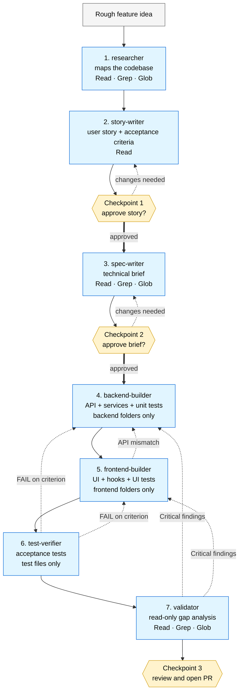

# The 7-Agent Factory Chain

Build a feature end-to-end through specialized agents, each with a clean context window and a narrow job. Three human checkpoints keep you in the loop where judgment matters; everything else runs on its own.

## How it runs

1. **researcher** maps the relevant code (read-only).
2. **story-writer** turns the idea into a user story with numbered acceptance criteria.
3. **Checkpoint 1** — you approve or revise the story.
4. **spec-writer** turns the approved story into a technical brief: data model, APIs, file-level change plan.
5. **Checkpoint 2** — you approve or revise the brief. This is where contract mistakes get caught before any file is touched.
6. **backend-builder** implements the backend half. Cannot touch frontend code.
7. **frontend-builder** implements the UI half. Consumes the backend's API contract verbatim; surfaces mismatches instead of patching.
8. **test-verifier** writes acceptance tests, one per numbered criterion. Reports `PASS | FAIL | UNCOVERED`.
9. **validator** does a read-only gap analysis against the story and brief. Reports `Critical | Important | Minor`.
10. **Checkpoint 3** — you review the diff and open the PR.

## Loop-back rules

- **test-verifier finds a failing criterion** → loops back to the appropriate builder with the criterion number.
- **validator finds Critical issues** → loops back to the appropriate builder until clean.
- **frontend-builder sees an API mismatch** → feedback returns to backend-builder; never patches client-side.

## Hard limits

Each loop step caps at 3 iterations. If a step doesn't converge, the chain pauses and asks — the problem is usually upstream (story or brief), not downstream (builders).

## Why this beats one big AI session

In vibe coding, one AI session is asked to be product analyst + architect + backend engineer + frontend engineer + test engineer + reviewer all at once. Wrong assumptions in the plan become wrong database models, wrong APIs, wrong UIs — silent compounding mistakes.

The chain forces separation of concerns. Each agent has one job, sees only what it needs, and is constrained to a narrow toolset. Mistakes get caught at the brief approval — not after 10 files have been changed.
