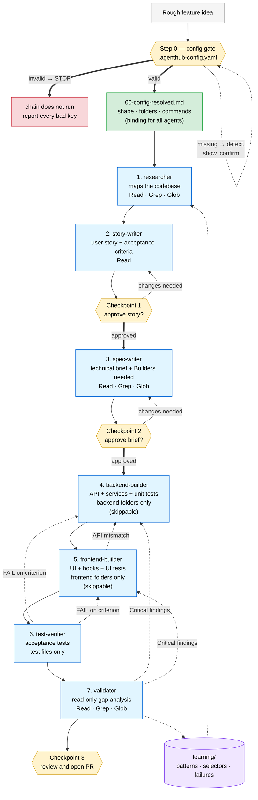

# The 7-Agent Factory Chain

Build a feature end-to-end through specialized agents, each with a clean context window and a narrow job. Three human checkpoints keep you in the loop where judgment matters; everything else runs on its own.

> **v0.2.0** — project shape, per-feature skip logic, escalating retry context, and learning directory are reflected below.

> **v0.3.0** — loop-back arrows now follow the generic [loop-engine protocol](04-loop-framework.md). See that diagram for the full lifecycle, escalating context flow, and operating modes.

> **v0.7.0** — Step 0 is now a **blocking gate**, not a lookup. A missing config is generated and confirmed; an invalid one stops the chain. The gate's decisions are written to `00-config-resolved.md`, which every later agent reads instead of re-deriving them.

## How it runs

0. **Step 0 — config gate (blocking).** Read and validate `.agenthub-config.yaml`. Missing → generate a candidate with `agent-hub-detect.sh -d`, show it, and require *accept / edit / abort*. Invalid → stop and report every bad key. Valid → write `00-config-resolved.md`, which binds `project.shape` (`full-stack` | `backend-only` | `frontend-only` | `library`), the folder scopes, and the exact commands for every later agent. **The chain never proceeds on assumed defaults.**
1. **researcher** maps the relevant code (read-only). Reads `learning/patterns.md` if present.
2. **story-writer** turns the idea into a user story with numbered acceptance criteria.
3. **Checkpoint 1** — you approve or revise the story.
4. **spec-writer** turns the approved story into a technical brief: data model, APIs, file-level change plan. Outputs a `Builders needed:` declaration for the orchestrator.
5. **Checkpoint 2** — you approve or revise the brief. This is where contract mistakes get caught before any file is touched.
6. **backend-builder** implements the backend half. *Skipped* when shape is `frontend-only` or when the brief marks its sections `None`.
7. **frontend-builder** implements the UI half. *Skipped* when shape is `backend-only` or `library`, or when the brief marks its section `None`. Consumes the backend's API contract verbatim; surfaces mismatches instead of patching.
8. **test-verifier** writes acceptance tests, one per numbered criterion. Reports `PASS | FAIL | UNCOVERED`.
9. **validator** does a read-only gap analysis against the story and brief. Reports `Critical | Important | Minor`. Appends recurring findings to `learning/failures.md`.
10. **Checkpoint 3** — you review the diff and open the PR.

## Why Step 0 blocks

This is the part students most often want to argue with: why stop the whole chain over a config file?

Because the cost of a missing config isn't paid once — it's paid by every agent downstream. In a real run where the config was absent, the chain assumed `full-stack` and then **four separate stages independently re-derived the same test commands** from `package.json`: the researcher, the spec-writer, and both builders. Resolving it once at Step 0 costs one read.

The inverse failure is worse. In another real run, a project *correctly* declared `shape: backend-only` — and frontend-builder was still spawned on **8 of 18 features**, each time burning a full context window to write a one-line "N/A — backend-only, this is a CLI" placeholder. Step 0 had the right answer; nothing made later steps honour it.

So the gate has two jobs, and the second is the one people forget:

| Job | Mechanism |
|---|---|
| Get a valid config | Generate → confirm → validate, or stop |
| **Make it binding** | Write `00-config-resolved.md`; every agent reads that, not the YAML |

An advisory Step 0 is not a gate. It's a suggestion with a nice table.

Full detail, including a graded exercise: [docs/config-gate-guide.md](../docs/config-gate-guide.md).

### What "invalid" means

A config naming things that don't exist is *worse* than no config, because agents will trust it and report green against commands that never ran. The gate rejects:

- folders or files that aren't there
- commands that resolve to no script or binary
- **backend and frontend scopes that overlap** — if `frontend.folders` contains `src/app` while `backend.folders` contains `src/app/api`, frontend-builder is authorised to rewrite your API routes
- a `project.shape` that isn't one of the four known values, or that contradicts the populated sections

The overlap rule has a wrinkle worth teaching: in Next.js App Router, `src/app` genuinely holds both halves — `api/` routes *and* `page.tsx`. The fix isn't to give the folder to one builder; it's to give the subtree to the backend and list the frontend's shell files under `frontend.files`.

## Loop-back rules

- **test-verifier finds a failing criterion** → loops back to the appropriate builder with the criterion number.
- **validator finds Critical issues** → loops back to the appropriate builder until clean.
- **frontend-builder sees an API mismatch** → feedback returns to backend-builder; never patches client-side.

## Hard limits

Each loop step caps at 3 iterations. If a step doesn't converge, the chain pauses and asks — the problem is usually upstream (story or brief), not downstream (builders).

## Escalating retry context

A retry that gets the same context as attempt 1 will produce the same mistake. Each attempt gets a progressively narrower, deeper view:

| Attempt | What the agent sees |
|---|---|
| 1 (initial) | Full brief + researcher findings + CLAUDE.md |
| 2 (first retry) | Specific failure + files changed in attempt 1 + one-paragraph summary |
| 3 (second retry) | Attempt-2 context + full failure traces + root-cause summary of both prior attempts |
| 4+ | Stop — pause and ask the user |

## Learning directory

If `<project>/.claude/feature-factory/learning/` exists, agents read and write three files across runs:

| File | Owner | Purpose |
|---|---|---|
| `patterns.md` | researcher | Cached codebase patterns — read at start, append novelties |
| `selectors.md` | test-verifier | CSS/XPath/API paths reused across features |
| `failures.md` | validator | Recurring findings — spec-writer reads to avoid repeating bad patterns |

The learning directory is per-project (not per-feature) and survives across chain runs.

## Why this beats one big AI session

In vibe coding, one AI session is asked to be product analyst + architect + backend engineer + frontend engineer + test engineer + reviewer all at once. Wrong assumptions in the plan become wrong database models, wrong APIs, wrong UIs — silent compounding mistakes.

The chain forces separation of concerns. Each agent has one job, sees only what it needs, and is constrained to a narrow toolset. Mistakes get caught at the brief approval — not after 10 files have been changed.
