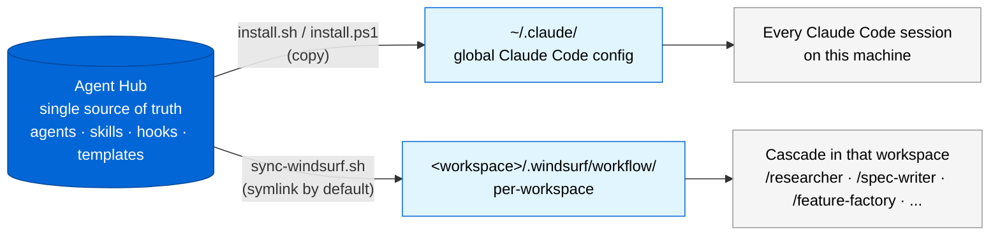

# Distribution: One Hub, Two Tools

A single source of truth feeds both Claude Code (global install) and Windsurf (per-workspace sync). Edit an agent once; both tools pick it up.

## Claude Code path

`./install.sh` (or `install.ps1` on Windows) copies the agent files into `~/.claude/agents/`, the skill into `~/.claude/skills/feature-factory/`, and the hook into `~/.claude/hooks/`. The install is global — agents become available in every Claude Code session on the machine.

Updating: re-run with `--force` to overwrite, or `--dry-run` first to preview.

## Windsurf path

`./sync-windsurf.sh <workspace>` symlinks the agents into `<workspace>/.windsurf/workflow/`. Each agent becomes a slash command in that workspace's Cascade — `/researcher`, `/spec-writer`, `/feature-factory`, and so on.

Because the default is symlink, edits to the hub flow into every synced workspace automatically — no re-sync needed. Use `--copy` if a workspace needs a frozen snapshot.

## Why two paths?

The split mirrors how each tool is configured:

| Tool | Configuration model |
|---|---|
| Claude Code | Global config in `~/.claude/`; one install covers all projects |
| Windsurf | Per-workspace `.windsurf/`; each workspace decides what it gets |

Agent file format is identical across both — Windsurf only requires `description:` in frontmatter and ignores the Claude-specific fields (`tools`, `model`, `version`, …).

## Cursor and Copilot

Not directly supported in v0.1. Both use schemas different enough that a symlink wouldn't work — they'd need translators. If usage justifies it, they can be added as additional sync scripts.
