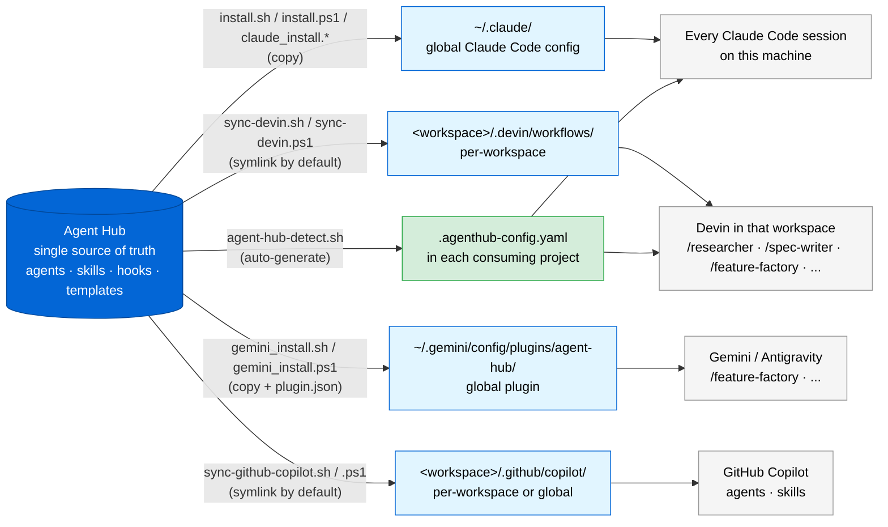

# Distribution: One Hub, Many Tools

A single source of truth feeds Claude Code (global install), Devin (per-workspace sync), Gemini/Antigravity (plugin), and GitHub Copilot (per-workspace or global sync). Edit an agent once; every tool picks it up.

> **v0.2.0** — added `agent-hub-detect.sh` for auto-generating per-project config.

## Claude Code path

`./install.sh` (or `install.ps1` on Windows) copies the agent files into `~/.claude/agents/`, the skill into `~/.claude/skills/feature-factory/`, and the hook into `~/.claude/hooks/`. The install is global — agents become available in every Claude Code session on the machine.

Updating: re-run with `--force` to overwrite, or `--dry-run` first to preview.

## Project config path

`./agent-hub-detect.sh` scans a consuming project and writes `.agenthub-config.yaml` with detected `project.shape`, language, framework, folder hints, and test/lint/typecheck commands. The config file stays in the project repo and is read by every agent at runtime.

Languages supported: Python, Node, Ruby, Go, Rust, Java (Maven + Gradle), .NET (C# / F#).

## Devin path

`./sync-devin.sh <workspace>` symlinks the agents into `<workspace>/.devin/workflows/`. Each agent becomes a slash command in that workspace's Devin — `/researcher`, `/spec-writer`, `/feature-factory`, and so on.

Because the default is symlink, edits to the hub flow into every synced workspace automatically — no re-sync needed. Use `--copy` if a workspace needs a frozen snapshot.

## Gemini / Antigravity path

`./gemini_install.sh` copies the modules into `~/.gemini/config/plugins/agent-hub/` and writes a `plugin.json` manifest. Antigravity discovers the plugin globally.

## GitHub Copilot path

`./sync-github-copilot.sh <workspace>` symlinks agents and the feature-factory skill into `<workspace>/.github/copilot/`. Pass `--global` to target `~/.copilot/` instead.

## Why multiple paths?

The split mirrors how each tool is configured:

| Tool | Configuration model |
|---|---|
| Claude Code | Global config in `~/.claude/`; one install covers all projects |
| Devin | Per-workspace `.devin/workflows/`; each workspace decides what it gets |
| Gemini / Antigravity | Global plugin in `~/.gemini/config/plugins/` |
| GitHub Copilot | Per-workspace `.github/copilot/` or global `~/.copilot/` |

Agent file format is identical across all of them — Devin only requires `description:` in frontmatter and ignores the Claude-specific fields (`tools`, `model`, `version`, …). Copilot uses the same files but in a different directory layout.
