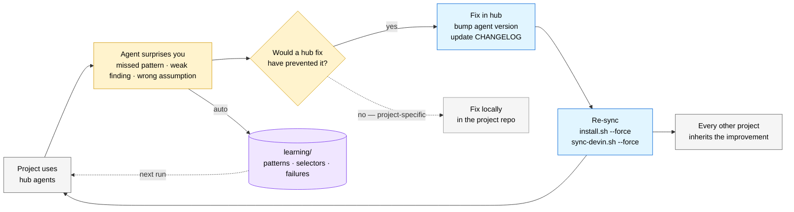

# The Drift Loop

The hub gets better by absorbing surprises from real projects. Every miss becomes a hub improvement that benefits every consuming project.

> **v0.2.0** — added the learning directory as a fast, project-local feedback path alongside the hub-level drift loop.

## The flow

1. An agent surprises you in a real project — missed a pattern, weak finding, broken assumption.
2. Diagnose root cause: would a fix in the hub have prevented it?
3. If yes → apply the fix in the hub, bump the agent's `version:` in frontmatter, update the CHANGELOG.
4. Propagate with `./install.sh --force` (Claude Code) or `./sync-devin.sh --force` (Devin). Symlinked Devin workspaces inherit the fix automatically.
5. Every other project inherits the improvement on its next sync.

## Two feedback loops

**Hub-level (slow, cross-project):** A surprise triggers a hub fix, version bump, and re-sync. Every project benefits.

**Learning directory (fast, project-local):** Agents automatically write to `learning/patterns.md`, `selectors.md`, and `failures.md` during each run. The next chain run in the same project reads those files and avoids repeat mistakes — no human action needed.

The two loops are complementary: the learning directory handles project-specific memory automatically; the hub loop captures generic patterns that deserve to be shared.

## Why it compounds

**Without a hub:** each project fixes the same class of issue locally. The same lesson is learned five times across five projects.

**With a hub:** one lesson, learned once, benefits every project. Over time the hub becomes an artifact of every surprise the user has ever caught.

## Concrete examples of what this catches

- **researcher** kept missing a `legacy/` directory in one repo → add config-driven scope hints to `researcher.md`.
- **spec-writer** didn't flag tenant isolation in a multi-tenant feature → add a tenant-isolation check to its mandatory output sections.
- **validator** missed a class of secrets-in-logs issue → extend `security.required-checks` defaults.

Each fix bumps a minor version, lands in the CHANGELOG, and silently makes every project safer the next time.

## What does NOT go through this loop

Project-specific fixes — e.g., a bookbuilder-specific chapter validator pattern. Those stay in the project's repo as local agents. The hub is for generic patterns only; see [the sorting rule in the main README](../README.md#what-does-not-belong-in-this-hub).
