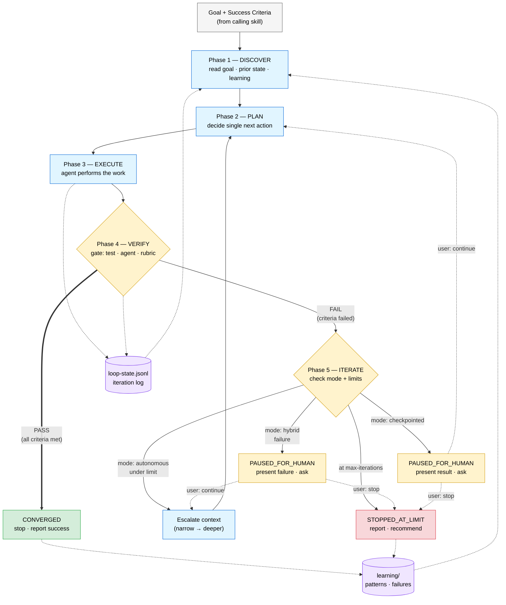
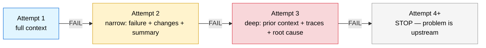

# The Loop Framework

The generic loop lifecycle that powers iterative work across the hub. Any skill that needs retry logic, verification gates, or goal-directed iteration follows this protocol.

> **v0.3.0** — introduced as a first-class building block alongside the factory chain and drift loop.



## The five phases

| Phase | What happens | Who does it |
|---|---|---|
| **DISCOVER** | Read the goal, prior state, and learning directory | Loop engine |
| **PLAN** | Decide the single next action | Calling skill's agent |
| **EXECUTE** | Perform the work | Calling skill's agent |
| **VERIFY** | Check against success criteria (the gate) | Verifier (test / agent / rubric) |
| **ITERATE** | Decide: done, retry with escalation, or stop at limit | Loop engine |

## Three operating modes

| Mode | When it pauses | Best for |
|---|---|---|
| `autonomous` | Only at limit | Fully automated loops with hard gates (test suites, linters) |
| `checkpointed` | Every iteration | High-stakes work where every change needs human approval |
| `hybrid` (default) | On failure or limit | Most real-world loops — fly when things work, stop when they don't |

## Escalating context

Each retry gets a progressively narrower, deeper view so the same mistake is not repeated:



## State persistence

Every iteration is logged as one JSON line in `loop-state.jsonl`:

```jsonl
{"iteration":1,"result":"FAIL","criteria_met":["C1"],"criteria_failed":["C2","C3"],"summary":"..."}
{"iteration":2,"result":"FAIL","criteria_met":["C1","C2"],"criteria_failed":["C3"],"summary":"..."}
{"iteration":3,"result":"PASS","criteria_met":["C1","C2","C3"],"criteria_failed":[],"summary":"..."}
```

This enables **resume** (pick up after interruption), **learning** (each iteration sees what failed before), and **reporting** (calling skill shows iteration history at its checkpoint).

## Cost awareness

Loops compound cost. The engine warns when:
- 3+ iterations with no new criteria met (spinning)
- Context growing >50% per iteration (compounding)

The key metric: **cost per accepted change**, not tokens spent or loops run.

## How the feature-factory uses this

The [feature-factory](../skills/feature-factory/SKILL.md) invokes the loop-engine protocol at 5 points:

| Loop point | Verifier | Max | Mode |
|---|---|---|---|
| Story checkpoint revisions | Human approval | 3 | checkpointed |
| Spec checkpoint revisions | Human approval | 3 | checkpointed |
| Backend ↔ frontend handoff | Frontend-builder feedback | 3 | hybrid |
| Test failure → builder fix | Test-verifier re-run | 3 | autonomous |
| Validator critical → builder fix | Validator re-run | 3 | autonomous |

See [01-factory-chain.md](01-factory-chain.md) for the full chain diagram with loop-back arrows.
