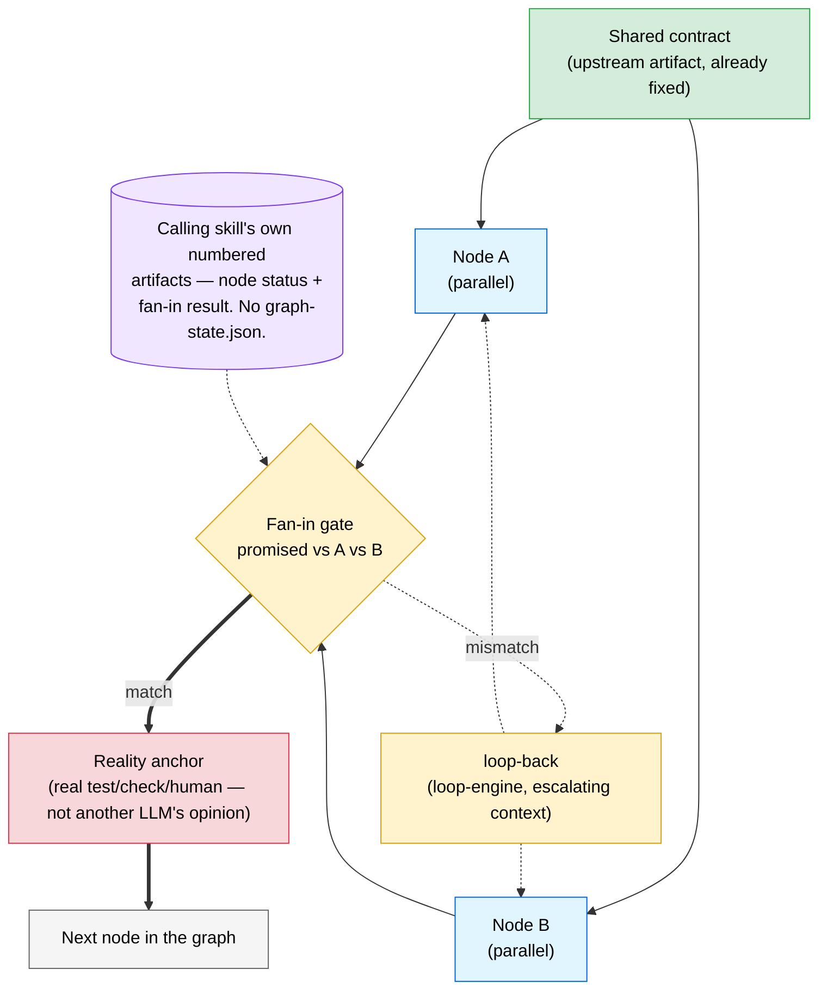
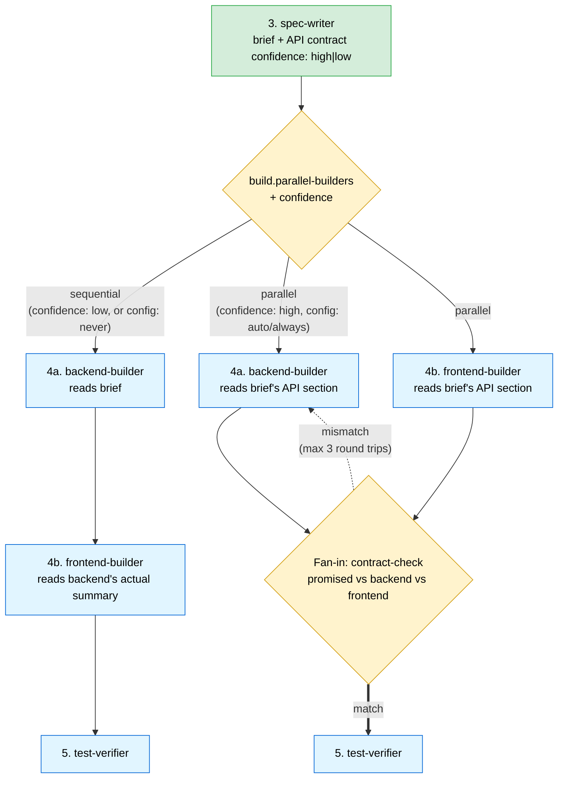

# The Graph Engine

The generic graph structure that formalizes fan-out, fan-in, and conditional routing across multiple nodes. A loop is one node with an edge back to itself; a graph is what you need once a skill has more than one.

> **v0.5.0** — introduced alongside `feature-factory`'s configurable backend/frontend parallelization.

> **v0.12.0** — `graph-state.json` removed as the default. For a linear chain with one fan-out/fan-in pair, node status and fan-in results are derived from the calling skill's own numbered artifacts instead. See "No separate state file" below — the diagram in this file no longer shows a separate state file.

## Generic shape: fan-out, fan-in, reality anchor

**The rule that keeps this honest:** Node A and Node B both read the *contract*, never each other's in-progress output. If B's real input is "A's actual result," the edge is sequential — draw it that way instead of forcing a fan-out.

**No separate state file.** An earlier version of this skill declared `graph-state.json` as the default. It was removed in `v0.12.0` after two real instances of the file actively lying — one recorded status for 2 of 7 participating nodes, another was written once, hours after the fact, under node names from an abandoned plan. For the common case (a linear chain with one fan-out/fan-in pair), node status is derivable from which numbered output files exist, and the fan-in result lives in that fan-in's own artifact (e.g. `04b-contract-check.md`) — see [skills/graph-engine/SKILL.md](../skills/graph-engine/SKILL.md#state-tracking).

## feature-factory redrawn as an explicit graph

The factory chain (see [01-factory-chain.md](01-factory-chain.md)) was always a graph — sequential edges, a couple of loop-backs, and one node pair that's either sequential or a genuine fan-out depending on brief quality. This makes that structure explicit for Step 4:

- **Sequential path** (unchanged from v0.4.0): backend builds first; frontend consumes backend's real summary as the contract.
- **Parallel path** (new): both builders read the brief's "API changes" section — the contract `spec-writer` already commits to writing "verbatim" — at the same time. The fan-in gate is a reality anchor: it diffs the brief's promise against backend's actual returned shapes against frontend's assumed shapes, not one LLM's opinion of another's code.
- Either path ends at the same `test-verifier` node — the graph choice only affects Step 4.

See [skills/feature-factory/SKILL.md](../skills/feature-factory/SKILL.md) Step 4 for the full decision logic and [docs/graph-guide.md](../docs/graph-guide.md) for the reasoning behind making this configurable rather than always-parallel.

## Relationship to the loop framework

Graph-engine composes loop-engine, it doesn't replace it:

| Layer | Owns | See |
|---|---|---|
| Graph | Which nodes run concurrently, what contract they share, how fan-in reconciles, which edge to take next | [skills/graph-engine/SKILL.md](../skills/graph-engine/SKILL.md) |
| Loop | What happens inside one node when its own verifier fails | [skills/loop-engine/SKILL.md](../skills/loop-engine/SKILL.md), [04-loop-framework.md](04-loop-framework.md) |

## Relationship to Claude Code dynamic workflows

| Graph-engine concept | Dynamic-workflow primitive |
|---|---|
| Node | `agent(prompt, opts)` |
| Parallel fan-out + fan-in barrier | `parallel(thunks)` |
| Same transform across many items | `pipeline(items, fn)` |
| Progress grouping | `phase(title)` |

Where dynamic workflows aren't available, fan-out nodes fall back to sequential subagent calls — the graph's structure (contract, fan-in, reality anchor) is unchanged either way.
