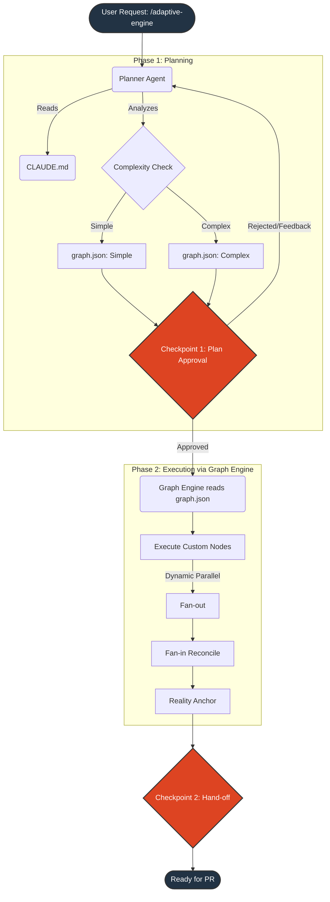

# Adaptive Engine Architecture

```mermaid
flowchart TD
    Start([User Request: /adaptive-engine]) --> Planner(Planner Agent)
    
    subgraph Phase 1: Planning
        Planner -->|Reads| ClaudeMD(CLAUDE.md)
        Planner -->|Analyzes| Complexity{Complexity Check}
        Complexity -->|Simple| GraphA[graph.json: Simple]
        Complexity -->|Complex| GraphB[graph.json: Complex]
        
        GraphA --> PlanApproval{Checkpoint 1: Plan Approval}
        GraphB --> PlanApproval
    end
    
    PlanApproval -->|Approved| Phase2
    PlanApproval -->|Rejected/Feedback| Planner
    
    subgraph Phase 2: Execution via Graph Engine
        Phase2(Graph Engine reads graph.json) --> ExecNodes[Execute Custom Nodes]
        ExecNodes -->|Dynamic Parallel| FanOut[Fan-out]
        FanOut --> FanIn[Fan-in Reconcile]
        FanIn --> Anchor[Reality Anchor]
    end
    
    Anchor --> HandOff{Checkpoint 2: Hand-off}
    HandOff --> End([Ready for PR])
    
    style Start fill:#234,stroke:#333,stroke-width:2px,color:#fff
    style End fill:#234,stroke:#333,stroke-width:2px,color:#fff
    style PlanApproval fill:#d42,stroke:#333,stroke-width:2px,color:#fff
    style HandOff fill:#d42,stroke:#333,stroke-width:2px,color:#fff
```
