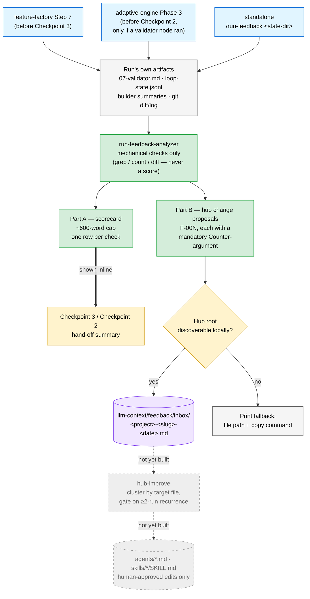

# Run Feedback

Mechanical, never self-graded: a completed run's own artifacts feed a fixed check table, which fans into a per-run scorecard shown inline at the checkpoint, and zero or more hub-change proposals filed to an inbox nobody has to remember to open.

> **v0.13.0** — introduced alongside the `run-feedback` skill and `run-feedback-analyzer` agent (item 8 of the run retrospective's recommended sequence). Explicitly stops at the producer side — `hub-improve`, the inbox consumer, is not built yet and is drawn below as a distinct, dashed shape so it is never mistaken for shipped behaviour.

## Flow

Grey, dashed nodes (`hub-improve`, the human-approved hub-file edit) are **not yet built**. Nothing today reads the inbox or auto-edits an `agents/*.md` or `skills/*/SKILL.md` file — a human reads Part A at the checkpoint and Part B's entries in the inbox, and a human decides what happens next.

## Why mechanical only

Every box under "mechanical checks" reduces to a `grep`, a count, or a diff — never a self-assessed quality score. This is the same rule `loop-engine` enforces for its own verifiers (the agent that did the work is too generous grading its own output), applied one layer up: `run-feedback` never lets the chain's own agents vouch for each other's work through a new file. See [docs/run-feedback-guide.md](../docs/run-feedback-guide.md) for the full check table and the reasoning.

## Two triggers, one skip condition

| Trigger | Gate |
|---|---|
| `feature-factory` Step 7 | Always runs, immediately before Checkpoint 3 |
| `adaptive-engine` Phase 3 | Runs only if the graph included a validator node — several checks read `07-validator.md`'s coverage report and have nothing to check without one |
| Standalone `/run-feedback <state-dir>` | Requires `07-validator.md` (or the graph-engine equivalent) already present |

## See also

- [docs/run-feedback-guide.md](../docs/run-feedback-guide.md) — full guide: the problem it solves, the check table explained, the output contract, and the "where this is headed" arc
- [agents/run-feedback-analyzer.md](../agents/run-feedback-analyzer.md) — the agent
- [skills/run-feedback/SKILL.md](../skills/run-feedback/SKILL.md) — the orchestrating skill
- [01-factory-chain.md](01-factory-chain.md) — Step 7's hand-off, where this folds in for `feature-factory`
